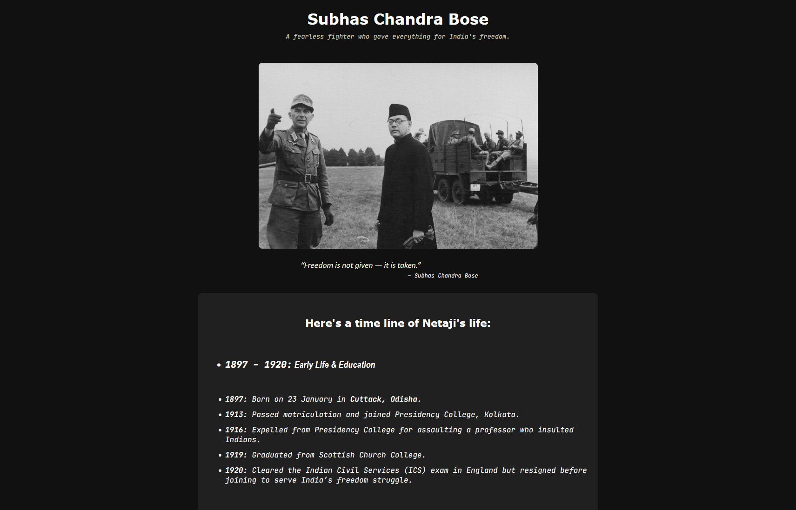

# Tribute Page: Netaji Subhas Chandra Bose

A responsive, minimal, and modern tribute page dedicated to **Netaji Subhas Chandra Bose**. Built with **HTML** and **CSS**, this project showcases a clean timeline of Netaji’s life, achievements, and legacy, emphasizing accessibility and user experience across all devices.

## Features

- **Responsive Design:** Seamlessly adapts to mobile, tablet, and desktop screens.
- **Minimal & Modern UI:** Clean layout, elegant typography, and subtle color palette for a focused reading experience.
- **Interactive Timeline:** Presents key milestones in Netaji’s life in a clear, chronological format.
- **Accessible:** Designed with semantic HTML for improved accessibility.
- **Fast & Lightweight:** Pure HTML and CSS, no dependencies.

## Preview

## Demo

View the live site here:  
[https://saikat-codes.github.io/tribute-page/](https://saikat-codes.github.io/tribute-page/)

## Getting Started

1. **Clone the repository:**

   git clone https://github.com/saikat-codes/tribute-page.git

2. **Open `index.html` in your browser.**
3. **Customize** the content or styles as needed.

## Technologies Used

- **HTML5**
- **CSS3** (`styles.css`)

## Folder Structure

/project-root
├── index.html
├── styles.css
└── README.md

## Customization

- Update tribute content and timeline in `index.html`.
- Modify styles in `styles.css` to match your preferences or branding.

## Credits

Built by [Saikat Das](https://github.com/saikat-codes).

---

Feel free to use or adapt this project for your own tributes or learning!
